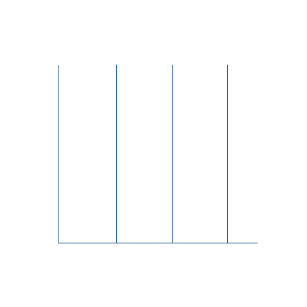

 
 
  

  

# 🐧About Me

🎓 I’m a fourth-year Information Technologies student at Azerbaijan State Oil and Industry University.    
💼 Currently working as a Frontend Developer and building freelance projects at P&R Creatives.  
🌱 Learning: TypeScript, Zustand, RTK Query, and building full-stack apps with Node.js.   
🧠 Strong skills in responsive design, React ecosystem, and API integration.   
💬 Ask me about: React, Redux, REST APIs, UI/UX design, and frontend architecture.

## 🌐 Socials

 

#  Tech Stack

  

### 🔹 Frontend Development

### 🔹 Backend Development

### 🔹 Database Management

### 🔹 Development Tools

  

  

    
  

#  Stats

  

    
    

#  Top Contributed Repo

